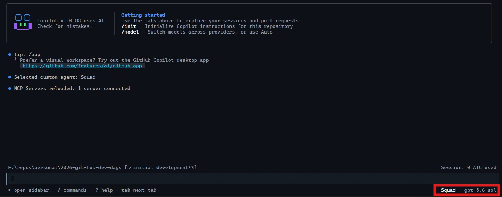

# Guía de demostración: Squad, APIM y Foundry

## Siglas y términos

| Término | Significado |
| --- | --- |
| API | Interfaz de programación de aplicaciones (*Application Programming Interface*) |
| APIM | Azure API Management, servicio que protege, limita y observa las llamadas a los modelos |
| AZD | Azure Developer CLI, herramienta de línea de comandos para aprovisionar y desplegar la solución |
| BYOK | *Bring Your Own Key*, uso de un proveedor y una credencial propios en lugar del routing incluido en Copilot |
| CLI | *Command-Line Interface*, interfaz de línea de comandos |
| JSON | *JavaScript Object Notation*, formato usado para archivos de configuración |
| KQL | *Kusto Query Language*, lenguaje usado para consultar Application Insights |
| MCP | *Model Context Protocol*, protocolo para conectar herramientas con los agentes |
| RBAC | *Role-Based Access Control*, control de acceso basado en roles de Azure |
| SDK | *Software Development Kit*, kit de desarrollo de software |
| TPM | *Tokens Per Minute*, tokens por minuto |
| URL | *Uniform Resource Locator*, dirección de un recurso web |
| `tfstate` | Archivo y contenedor donde Terraform guarda el estado de la infraestructura |

Las palabras **Squad**, **Foundry**, **Copilot**, **Terraform** y **PowerShell** son nombres de productos o herramientas, no siglas.

Esta guía describe la demostración completa en Windows:

```text
Squad -> GitHub Copilot CLI con BYOK -> Azure API Management -> Microsoft Foundry
```

La demostración construye un Tetris mínimo jugable en Terminalon agentes de Squad. Cada agente usa un modelo diferente desplegado en Foundry y todas las llamadas pasan por APIM.

## Reglas que debes respetar durante la demostración

- Los comandos `squad` se ejecutan en PowerShell, **no** dentro del prompt de Copilot. Sal con `/exit` antes de usarlos.
- Las instrucciones (*prompts*) se escriben **dentro** del prompt de Copilot.
- Después de iniciar cada sesión de Copilot usada en la demo, escribe `/allow-all on` dentro del prompt para evitar confirmaciones repetitivas. Este comando concede automáticamente las aprobaciones de herramientas durante esa sesión; úsalo solo en este repositorio de demostración.
- Cambiar `$env:COPILOT_*` no afecta a una sesión de Copilot ya abierta. Para aplicar un cambio, cierra la sesión con `/exit`, cambia la variable y vuelve a lanzar `copilot`.
- La Terminal de la sesión de Squad conserva sus variables `COPILOT_*` y la clave de `demo-inference`. La Terminal de prueba del paso 12 configura su propia sesión BYOK con la clave de `demo-ratelimit`; los scripts solicitan sus claves de forma interactiva.

## 1. Requisitos

Instala estas herramientas y comprueba que están disponibles en PowerShell 7:

```powershell
az --version
azd version
terraform version
copilot --version
squad --version
dotnet --version
```

Compara la salida de esos comandos con esta tabla:

| Herramienta | Versión mínima | Verificada en esta demostración | Origen del mínimo |
| --- | --- | --- | --- |
| PowerShell | 7.0 | 7.6.6 | Esta guía usa sintaxis de PowerShell 7 |
| Terraform | 1.14.0 | 1.16.2 | `required_version` en [infra/resources/providers.tf](../infra/resources/providers.tf) |
| .NET SDK | 10.0 | 10.0.401 | El Tetris del paso 11 exige .NET 10 |
| Azure CLI (`az`) | Sin mínimo declarado | 2.90.0 | — |
| Azure Developer CLI (`azd`) | Sin mínimo declarado | 1.34.2 | — |
| GitHub Copilot CLI | Sin mínimo declarado | 1.0.88 | — |
| Squad | Sin mínimo declarado | 0.13.1 | — |

Las tres primeras filas son requisitos: por debajo de esas versiones la demostración falla. Las cuatro últimas no tienen mínimo fijado en el repositorio; se indican las versiones con las que se comprobó la demostración, así que úsalas como referencia si algo no funciona.

Necesitas permisos de Azure para:

- Crear recursos en la suscripción de Azure;
- Asignar roles RBAC (*Role-Based Access Control*);
- Crear el estado remoto de Terraform;
- Consultar Application Insights;
- Ejecutar GitHub Copilot CLI (*Command-Line Interface*) y Squad.

No guardes claves de APIM en archivos, comandos históricos ni el repositorio.

## 2. Proporcionar los datos del entorno

La persona que ejecuta la demostración debe proporcionar:

- El identificador de la suscripción de Azure;
- El nombre del entorno de `azd`.

Solicítalos al principio de la demostración:

```powershell
$SubscriptionId = Read-Host 'Azure subscription ID'
$EnvironmentName = Read-Host 'azd environment name'
```

Inicia sesión en el tenant correspondiente y selecciona la suscripción:

```powershell
az login
az account set --subscription $SubscriptionId
azd config set auth.useAzCliAuth true
az account show --query '{subscription:id,tenant:tenantId,name:name}' --output table
```

Comprueba que la suscripción mostrada coincide con `$SubscriptionId`.

## 3. Crear el entorno AZD

Sitúate en la raíz del repositorio. Esta ruta depende de dónde lo hayas clonado; solicítala al principio de la demostración:

```powershell
$RepositoryRoot = Read-Host 'Ruta local del repositorio'
Set-Location $RepositoryRoot
azd env new $EnvironmentName
azd env set AZURE_SUBSCRIPTION_ID $SubscriptionId
```

Si el entorno ya existe, selecciónalo en lugar de crearlo:

```powershell
azd env select $EnvironmentName
azd env set AZURE_SUBSCRIPTION_ID $SubscriptionId
```

## 4. Aprovisionar con `azd up`

Ejecuta el aprovisionamiento completo:

```powershell
azd up -e $EnvironmentName
```

La ejecución de `azd up` puede solicitarte algunos valores, el más probable es la región de Azure, la cual puede ser cualquiera ya que las regiones de la demo están establecidas como valores por defecto en las variables de Terraform. El proceso de aprovisionamiento puede tardar varios minutos, y ejecuta las capas declaradas en [azure.yaml](../azure.yaml) en este orden:

1. `backend`: crea el grupo de recursos, el Azure Storage Account y el contenedor privado `tfstate` para el estado remoto de Terraform;
2. `resources`: crea el Microsoft Foundry, Azure API Management (APIM), Application Insights, Log Workspace Analytics, las políticas y los deployments de modelos.

**El Azure Storage Account del estado de Terraform forma parte de este despliegue. No lo crees manualmente antes de ejecutar `azd up`.**

Espera a que `azd up` termine correctamente antes de continuar.

## 5. Validar el despliegue

Ejecuta las comprobaciones locales:

```powershell
./scripts/preflight.ps1
```

Obtén la URL (*Uniform Resource Locator*) compatible con la API de OpenAI de APIM y las regiones desplegadas. La ejecución de `azd` guarda todas las salidas de Terraform en el entorno activo, así que no hace falta consultar el estado remoto:

```powershell
$AzdValues = azd env get-values --output json | ConvertFrom-Json
$CopilotBaseUrl = $AzdValues.copilot_base_url
$PrimaryRegion = $AzdValues.primary_region
$SecondaryRegion = $AzdValues.secondary_region
$CopilotBaseUrl
```

No uses `terraform -chdir=infra/resources output`, ya que el comando `azd` copia cada capa declarada en [azure.yaml](../azure.yaml) a `.azure/<entorno>/infra/<capa>/` e inicializa allí el backend, por lo que el directorio del repositorio no contiene ni estado ni proveedores.

## 6. Obtener una clave de APIM

El despliegue crea tres suscripciones de APIM con propósitos distintos:

| Suscripción | Uso | Límite aplicado |
| --- | --- | --- |
| `demo-inference` | Sesión de Copilot y Squad durante toda la demostración | Sin límite de tokens aplicado por APIM; Foundry conserva sus propios límites |
| `demo-failover` | Prueba de conmutación regional | 60.000 tokens por minuto y cuota diaria de 500.000 tokens |
| `demo-ratelimit` | Prueba deliberada de `429` en el paso 12 | 2.000 tokens por minuto con estimación previa del *prompt* |

La suscripción `demo-inference` no ejecuta la política `llm-token-limit` de APIM. Por eso APIM no rechaza por TPM ni por cuota diaria las peticiones de la sesión de Squad; sin embargo Microsoft Foundry todavía puede aplicar el límite de tokens del *deployment* y sus cuotas regionales.

En Azure Portal:

1. Abre el servicio API Management desplegado.
2. Abre **Subscriptions**.
3. Selecciona `demo-inference`.
4. Copia la clave primaria.
5. Repite los pasos 3 y 4 para `demo-ratelimit` y guarda esa clave para el paso 12.
6. Repite los pasos 3 y 4 para `demo-failover` y guarda esa clave para el paso 15.
7. No las guardes en el repositorio ni las pegues en una captura.

Carga la clave de `demo-inference` en memoria como secreto de PowerShell, en la Terminal:

```powershell
$SubscriptionKey = Read-Host 'APIM demo-inference primary key' -AsSecureString
$Pointer = [Runtime.InteropServices.Marshal]::SecureStringToBSTR($SubscriptionKey)
try {
    $env:COPILOT_PROVIDER_HEADERS = 'Ocp-Apim-Subscription-Key: ' +
        [Runtime.InteropServices.Marshal]::PtrToStringBSTR($Pointer)
} finally {
    [Runtime.InteropServices.Marshal]::ZeroFreeBSTR($Pointer)
    $SubscriptionKey = $null
}
```

Este bloque existe porque hay un conflicto entre dos necesidades: la clave no debe quedar registrada en ningún sitio, pero Copilot CLI solo la acepta como texto plano en una variable de entorno. El resultado es que **la clave solo queda en `$env:COPILOT_PROVIDER_HEADERS`, dentro de este proceso de PowerShell, y desaparece al cerrar la terminal**. Por eso la guía nunca te pide guardarla en un archivo.

Las otras claves (`demo-ratelimit` y `demo-failover`) se cargarán de forma interactiva en los pasos 12 y 15, respectivamente.

## 7. Configurar Copilot CLI en modo BYOK

Configura Copilot para usar APIM como proveedor compatible con la API de OpenAI:

```powershell
$env:COPILOT_PROVIDER_TYPE = 'openai'
$env:COPILOT_PROVIDER_BASE_URL = $CopilotBaseUrl
$env:COPILOT_PROVIDER_WIRE_API = 'responses'
$env:COPILOT_MODEL = 'gpt-5.6-sol'
```

`COPILOT_PROVIDER_BASE_URL` activa *BYOK* (*Bring Your Own Key*). Desde ese momento, Copilot CLI usa el endpoint de APIM y no el *routing* de modelos incluido en la licencia.

El modelo `gpt-5.6-sol` se usa para el coordinador. Los especialistas recibirán sus propios modelos mediante la configuración de Squad.

El *gateway* expone *Responses API* para Copilot y los scripts de prueba. Los modelos de razonamiento la necesitan cuando Squad utiliza *function tools*.

Puedes abrir aquí una sesión corta para verificar que la configuración BYOK responde. La sesión definitiva se inicia en el paso 9:

```powershell
copilot --model gpt-5.6-sol --secret-env-vars=COPILOT_PROVIDER_HEADERS
```

Cierra esta sesión de verificación con `/exit` antes de continuar. En el paso 8 ejecutarás `squad init` desde PowerShell y después iniciarás una sesión del coordinador para crear el roster.

## 8. Crear el equipo de Squad

Ejecuta `squad init` en la Terminal, desde PowerShell y sin una sesión de Copilot abierta. Después iniciarás una sesión del coordinador en la misma terminal; esa sesión hereda las variables `COPILOT_*` y crea el roster a través de APIM.

Si el proyecto todavía no está inicializado para Squad, ejecuta primero:

```powershell
squad init --state-backend local --no-workflows
```

Este comando prepara la estructura local de Squad en el proyecto actual:

- `squad init` crea el layout basado en Markdown bajo `.squad/` y deja preparado el archivo de configuración persistente del equipo. No añade por sí solo los cinco especialistas de esta demostración; esos se incorporan después mediante el coordinador de Squad.
- `--state-backend local` configura el estado de Squad para que se mantenga en el propio proyecto, en lugar de usar un backend alternativo o un equipo remoto.
- `--no-workflows` evita que Squad escriba workflows de GitHub Actions bajo `.github/`. La demostración ejecuta Squad desde la Terminal y no necesita automatizaciones de GitHub Actions.

La inicialización es segura de repetir pues los archivos existentes se conservan. Si ya existe el directorio `.squad/` y el proyecto está inicializado, omite este comando.

**Es importante contestar que "no" (`n`) cuando se pregunte por *"Add @copilot as an autonomous team member?"***

Para crear los agentes especialistas del Squad, inicia una sesión del coordinador:

```powershell
copilot --agent squad --model gpt-5.6-sol --secret-env-vars=COPILOT_PROVIDER_HEADERS
```

Tras cargar Copilot, debes ver una pantalla como la siguiente donde el agente de Squad está activo y el modelo `gpt-5.6-sol` seleccionado.



Dentro del prompt de Copilot, activa las aprobaciones automáticas:

```text
/allow-all on
```

Escribe esta instrucción en el prompt de Copilot:

```text
Por favor configura el roster de Squad con estos cinco especialistas:
- `shuri`, con rol `lead`
- `arcade`, con rol `game-developer`
- `ironman`, con rol `backend`
- `hulk`, con rol `tester`
- `vision`, con rol `docs`
```

Confirma la propuesta del coordinador cuando muestre los cinco especialistas. El coordinador creará sus archivos `charter.md` e `history.md`, actualizará `.squad/team.md`, `.squad/routing.md` y `.squad/casting/registry.json`, y mantendrá los cuatro agentes integrados. Después escribe `/exit` para volver a PowerShell.

Comprueba el *roster*, preferentemente en otro terminal para no cortar la ejecución del coordinador en Copilot:

```powershell
squad cast
```

El equipo debe contener cinco especialistas de la demostración y los cuatro agentes integrados, para un total de nueve agentes.

```text
Session Cast (9 agents):

  Project agents:  9

  Name          Role                                              Origin        Ghost Protocol
  ────────────  ────────────────────────────────────────────────  ───────────── ──────────────
  arcade        Game Developer                                    project       –
  Fact Checker  Devil's Advocate & Verification Agent             project       –
  hulk          Tester                                            project       –
  ironman       Backend                                           project       –
  Rai           RAI Reviewer                                      project       –
  Ralph         Work Monitor                                      project       –
  Scribe        Session Logger, Memory Manager & Decision Merger  project       –
  shuri         Lead                                              project       –
  vision        Docs                                              project       –
```

## 9. Asignar un modelo Foundry a cada miembro

Este paso se ejecuta **dentro** de una sesión de Copilot. Iníciala en la Terminal si la cerraste al terminar el paso 8:

```powershell
copilot --agent squad --model gpt-5.6-sol --secret-env-vars=COPILOT_PROVIDER_HEADERS
```

Dentro del prompt de Copilot, activa las aprobaciones automáticas:

```text
/allow-all on
```

Escribe la siguiente instrucción en el prompt de Copilot, no en PowerShell:

```text
Por favor realiza una actualización en cada miembro del squad para que segun la siguiente lista cada agente use un modelo específico:

- Miembro `shuri`: gpt-5.6-sol
- Miembro `arcade`: gpt-5.6-terra
- Miembro `ironman`: gpt-5.6-terra
- Miembro `hulk`: gpt-5.6-terra
- Miembro `vision`: gpt-5.6-luna
```

Squad debe guardar los overrides en `.squad/config.json`. La estructura esperada es equivalente a esta:

```json
{
  "version": 1,
  "stateBackend": "local",
  "agentModelOverrides": {
    "shuri": "gpt-5.6-sol",
    "arcade": "gpt-5.6-terra",
    "ironman": "gpt-5.6-terra",
    "hulk": "gpt-5.6-terra",
    "vision": "gpt-5.6-luna"
  }
}
```

## 10. Confirmar que Squad usa Foundry

Antes de pedir código, abre Application Insights en Azure Portal desde el navegador, sin tocar la Terminal:

1. Abre el recurso de Application Insights.
2. Selecciona **Logs**.
3. Selecciona un rango de tiempo corto, por ejemplo **Last 15 minutes**.
4. Ejecuta esta consulta inicial:

```kusto
customMetrics
| where timestamp > ago(30m)
| where name == "Total Tokens"
| extend Subscription = tostring(customDimensions["Subscription ID"]),
         Backend = tostring(customDimensions["Backend ID"])
| summarize Tokens = sum(valueSum) by Subscription, Backend
| order by Subscription asc, Backend asc
```

Anota los resultados.

En la sesión de Squad, solicita una tarea pequeña y explícita:

```text
Pide a Shuri que diseñe la arquitectura mínima del Tetris de terminal.
Pide a Vision que documente las decisiones.
No escribas código todavía.
```

Espera a que terminen los agentes más algunos minutos adicionales mientras la telemetría llega a Application Insights, entonces vuelve a ejecutar la consulta.

Debe aumentar la fila:

```text
Subscription: demo-inference
Backend:      foundry-primary
```

Esta evidencia demuestra que la ejecución de Squad generó llamadas que atravesaron APIM y llegaron al Microsoft Foundry primario definido como *backend*.

La consulta actual identifica la suscripción y la región de *backend*. No identifica todavía el modelo en la métrica de APIM. Para demostrar el modelo individual, usa los anuncios de modelo de Squad junto con los *deployments* de Foundry y verifica el consumo del *deployment* en las métricas del recurso Foundry.

## 11. Construir el Tetris

Continúa en la sesión de Squad abierta en el paso 9 y solicita el desarrollo por fases:

```text
Por favor construye un Tetris mínimo jugable en terminal usando .NET 10 y C#.

Condiciones:
- Usa una solución .NET 10 ejecutable desde Windows PowerShell;
- Implementa tablero, piezas, movimiento, rotación, caída y puntuación;
- Usa controles de teclado en terminal;
- No añadas interfaz gráfica;
- Mantén el alcance mínimo y jugable;
- Trabaja por fases y pide revisión al especialista correspondiente, o en su defecto al humano.
```

Después solicita las fases en este orden:

```text
Shuri: define la arquitectura mínima y las decisiones técnicas.
Arcade: implementa el bucle de juego y la representación del tablero.
Ironman: revisa la estructura .NET y corrige problemas de diseño.
Hulk: crea y ejecuta pruebas para colisiones, líneas completas y puntuación.
Vision: documenta cómo compilar y ejecutar el juego.
```

Cuando el equipo termine, comprueba que existe una aplicación .NET compilable. Ejecuta esto en otra Terminal para no cerrar la sesión de Squad. Busca el directorio donde Squads ha colocado el código fuente y navega hasta allí antes de ejecutar los comandos.

```powershell
dotnet build
dotnet run
```

Juega una partida corta para demostrar que el resultado es ejecutable.

## 12. Provocar un `429` durante el trabajo de Squad

Esta prueba usa la suscripción APIM `demo-ratelimit`, limitada a 2.000 tokens por minuto. Squad sigue trabajando con `demo-inference`, que no tiene límite de tokens aplicado por APIM.

Vamos a necesitar usar dos terminales simultáneas:

- **Terminal de Squad:** conserva la sesión abierta en el paso 9, autenticada con `demo-inference`. No la cierres ni cambies su configuración;
- **Terminal de prueba:** abre una sesión PowerShell nueva en la raíz del repositorio. Configúrala para usar Copilot con `demo-ratelimit`; no reutilices la clave de `demo-inference`.

En la **terminal de prueba**, carga la URL y configura Copilot para usar el mismo modelo y protocolo BYOK del paso 7:

```powershell
$AzdValues = azd env get-values --output json | ConvertFrom-Json
$env:COPILOT_PROVIDER_TYPE = 'openai'
$env:COPILOT_PROVIDER_BASE_URL = $AzdValues.copilot_base_url
$env:COPILOT_PROVIDER_WIRE_API = 'responses'
$env:COPILOT_MODEL = 'gpt-5.6-sol'

$SubscriptionKey = Read-Host 'APIM demo-ratelimit primary key' -AsSecureString
$Pointer = [Runtime.InteropServices.Marshal]::SecureStringToBSTR($SubscriptionKey)
try {
    $env:COPILOT_PROVIDER_HEADERS = 'Ocp-Apim-Subscription-Key: ' +
        [Runtime.InteropServices.Marshal]::PtrToStringBSTR($Pointer)
} finally {
    [Runtime.InteropServices.Marshal]::ZeroFreeBSTR($Pointer)
    $SubscriptionKey = $null
}

copilot --model gpt-5.6-sol --secret-env-vars=COPILOT_PROVIDER_HEADERS
```

Dentro del prompt de Copilot, activa las aprobaciones automáticas:

```text
/allow-all on
```

Envía solicitudes de análisis del proyecto que generen suficiente consumo para superar el límite. Por ejemplo:

```text
Revisa en detalle el Tetris que acabamos de construir: analiza el bucle de juego,
las colisiones, la limpieza de líneas y la puntuación. Devuelve un informe amplio
con los problemas encontrados y propuestas concretas, pero no modifiques archivos.
```

Esto puede tardar en mostrar un error (cerca de un minuto), así que para verificarlo rápidamente durante la demo puedes pasar directamente al paso 14.

Si Copilot responde a la primera solicitud, envía otra petición de análisis mientras siga activa la ventana de un minuto. La política estima los tokens del prompt; cuando se supera el límite, APIM rechaza la llamada antes de enviarla a Foundry y Copilot muestra el error `429` del gateway. No cierres ni reinicies esta sesión entre las solicitudes.


No repitas esta prueba con `demo-inference` esperando un `429` de APIM: esa suscripción está exenta de `llm-token-limit`. Si Foundry alcanza el límite propio del deployment, cambiar la suscripción no lo evita.

## 13. Mostrar el `429` en Application Insights

En Application Insights, ejecuta esta consulta KQL (*Kusto Query Language*) tras unos minutos para mostrar las trazas:

```kusto
requests
| where timestamp > ago(30m)
| where resultCode == "429"
| project timestamp, name, resultCode, operation_Id
| order by timestamp desc
```

## 14. Demostrar que no existe fallback hacia GitHub Copilot

Esta prueba necesita una terminal nueva. No modifiques la terminal: si sobrescribes su clave, perderás la sesión de trabajo y tendrás que volver a introducir la clave válida.

Abre una terminal PowerShell nueva en la raíz del repositorio y configúrala con una clave inválida:

```powershell
$AzdValues = azd env get-values --output json | ConvertFrom-Json

$env:COPILOT_PROVIDER_TYPE = 'openai'
$env:COPILOT_PROVIDER_BASE_URL = $AzdValues.copilot_base_url
$env:COPILOT_PROVIDER_WIRE_API = 'responses'
$env:COPILOT_MODEL = 'gpt-5.6-sol'
$env:COPILOT_PROVIDER_HEADERS = 'Ocp-Apim-Subscription-Key: invalid-for-demo'

copilot --agent squad --model gpt-5.6-sol --secret-env-vars=COPILOT_PROVIDER_HEADERS
```

Dentro del prompt de Copilot, activa las aprobaciones automáticas:

```text
/allow-all on
```

Solicita una respuesta sencilla:

```text
Responde únicamente: BYOK conectado.
```

El resultado esperado es un error `401` o equivalente del *gateway*. Copilot no debe responder usando los modelos incluidos en la licencia.


Cierra la sesión con `/exit` y **cierra por completo la terminal**. Así garantizas que la clave inválida no se reutiliza en el resto de la demostración. Continúa en la Terminal, que conserva la clave válida.

## 15. Demostrar el failover regional

Esta prueba mantiene una ventana de *failover* para enviar una petición desde Copilot. No ejecutes la prueba mientras Squad u otra carga esté usando el *gateway*: el cambio temporal del *backend* primario afecta a todas las suscripciones.

Usa dos terminales nuevas:

- **Terminal de Copilot:** usa una sesión BYOK con la clave de `demo-inference`. **Crea uno nuevo, no reutilices la Terminal de pasos anteriores**
- **Terminal de control:** ejecuta el script con la clave de `demo-failover`. El script redirige temporalmente el *backend* primario a respuestas `503`, comprueba la región secundaria y restaura el *backend* al salir.

En la **terminal de Copilot**, configura BYOK e inicia una sesión nueva. Introduce tú mismo la clave, sin guardarla en archivos ni compartirla:

```powershell
$AzdValues = azd env get-values --output json | ConvertFrom-Json
$env:COPILOT_PROVIDER_TYPE = 'openai'
$env:COPILOT_PROVIDER_BASE_URL = $AzdValues.copilot_base_url
$env:COPILOT_PROVIDER_WIRE_API = 'responses'
$env:COPILOT_MODEL = 'gpt-5.6-sol'

$SubscriptionKey = Read-Host 'APIM demo-inference primary key' -AsSecureString
$Pointer = [Runtime.InteropServices.Marshal]::SecureStringToBSTR($SubscriptionKey)
try {
  $env:COPILOT_PROVIDER_HEADERS = 'Ocp-Apim-Subscription-Key: ' +
    [Runtime.InteropServices.Marshal]::PtrToStringBSTR($Pointer)
} finally {
  [Runtime.InteropServices.Marshal]::ZeroFreeBSTR($Pointer)
  $SubscriptionKey = $null
}

copilot --model gpt-5.6-sol --secret-env-vars=COPILOT_PROVIDER_HEADERS
```

Deja Copilot abierto, sin enviar todavía la petición. En la **terminal de control**, obtén los parámetros del entorno y lanza el script:

```powershell
$AzdValues = azd env get-values --output json | ConvertFrom-Json

./scripts/test-failover.ps1 `
  -SubscriptionId $AzdValues.AZURE_SUBSCRIPTION_ID `
  -ResourceGroup $AzdValues.resource_group_name `
  -ServiceName $AzdValues.apim_name `
  -GatewayUrl $AzdValues.apim_gateway_url `
  -ExpectedPrimaryUrl $AzdValues.apim_primary_backend_url `
  -PrimaryRegion $AzdValues.primary_region `
  -SecondaryRegion $AzdValues.secondary_region `
  -HoldSeconds 120
```

El script pide la clave de `demo-failover` de forma interactiva. Espera a que muestre `Secondary region is available for the next 120 seconds`. Entonces, dentro del prompt de Copilot de la otra terminal, envía:

```text
Responde en una frase: ¿cuál es la función de un circuit breaker en un gateway?
```

Copilot debería responder normalmente: el *failover* es transparente para el cliente. En Application Insights, comprueba que las llamadas de `demo-inference` durante la ventana usaron `foundry-secondary` (tras esperar unos minutos, que las trazas tardan en llegar a Application Insights):

```kusto
customMetrics
| where timestamp > ago(30m)
| where name == "Total Tokens"
| extend Subscription = tostring(customDimensions["Subscription ID"]),
         Backend = tostring(customDimensions["Backend ID"])
| where Subscription == "demo-inference"
| summarize Tokens = sum(valueSum) by Subscription, Backend
| order by Backend asc
```

## 16. Consultar tokens por suscripción y backend

En Application Insights, ejecuta:

```kusto
customMetrics
| where timestamp > ago(24h)
| where name in ("Total Tokens", "Prompt Tokens", "Completion Tokens")
| extend Subscription = tostring(customDimensions["Subscription ID"]),
         Backend = tostring(customDimensions["Backend ID"])
| summarize Tokens = sum(valueSum) by Subscription, Backend, Metric = name
| order by Subscription asc, Backend asc, Metric asc
```

Interpreta las columnas así:

| Columna | Significado |
| --- | --- |
| `Subscription` | Suscripción APIM que autenticó la llamada, por ejemplo `demo-inference` |
| `Backend` | Backend seleccionado por APIM, por ejemplo `foundry-primary` |
| `Metric` | Tipo de tokens contabilizado |
| `Tokens` | Suma de tokens emitida por APIM en el periodo consultado |

Además del límite por minuto, `demo-failover` aplica una cuota diaria de 500.000 tokens. APIM devuelve la cuota restante en la cabecera `x-demo-remaining-quota-tokens` de cada respuesta aceptada de esa suscripción y responde `403` cuando la cuota se agota. `demo-inference` está exenta de estas políticas de cuota de APIM.

Estas métricas no son una factura y no atribuyen todavía consumo a un especialista individual. La atribución actual es por suscripción APIM.

## 17. Al finalizar

Cierra después todas las terminales de la demostración. La clave de APIM solo vive en la memoria del proceso de PowerShell, así que cerrar la terminal la elimina.

Para detener cualquier coste de la demostración, destruye el entorno con el comando de `azd down`:

```powershell
azd down --force
```

No ejecutes `azd down` durante la demostración.

## 18. Limitaciones conocidas

- APIM registra actualmente suscripción y *backend*, no el especialista de Squad ni el *deployment* de modelo como dimensiones métricas.
- El límite estricto de 2.000 tokens por minuto se aplica solo a `demo-ratelimit`. `demo-failover` conserva el límite general de 60.000 tokens por minuto y la cuota diaria; `demo-inference` está exenta de ambos límites de APIM.
- La exención de APIM no elimina los límites del deployment de Foundry. Una petición grande puede ser rechazada por el TPM o la cuota regional del modelo antes de que APIM reciba una respuesta.
- El `429` demuestra gobernanza de consumo, no *failover* regional.
- El *gateway* publica *Responses API*. Tanto Copilot como los scripts de prueba usan `/responses`.
- Los modelos de *fallback* predeterminados de Squad pueden incluir proveedores que no pertenecen a Foundry. Para esta demostración no aceptes *fallbacks* externos.
